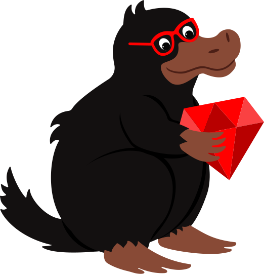

<!DOCTYPE HTML>
<html lang="en">
<head>
	<meta charset="UTF-8">
	<title> CodeNiffler - Home</title>
	<link rel="stylesheet" type="text/css" href="styles/global.css">
</head>
<body>
		<header>
				<figure class="small_logo">
					
				</figure>
				<figure class="small_logo">
					
				</figure>
				<h1>CodeNiffler</h1>
			<nav>
				<ul>
					<li><a href="index.html">Home</a></li>
					<li><a href="blog.html">Blog</a></li>
					<li><a href="presentations.html">Presentations</a></li>
					<li><a href="about.html">About</a></li>
					<li><a href="http://feedthebunny.herokuapp.com/" target="_blank">Feed the Bunny</a>
				</ul>
			</nav>
		</header>
    <main>
			

					<figure id="gem_blog">
						
					</figure>
					<figure class="home_page_img" id="gem_presentations">
						
					</figure>
				<figure class="home_page_img" id="gem_about">
					
				</figure>
				<figure id="niffler_large">
					
				</figure>
				<figure class="home_page_img" id="feed_the_bunny">
					
				</figure>
		

    </main>
		<footer>
			<ul>
				<li></li>
				<li></li>
				<li></li>
			</ul>
		</footer>
</body>
</html>
